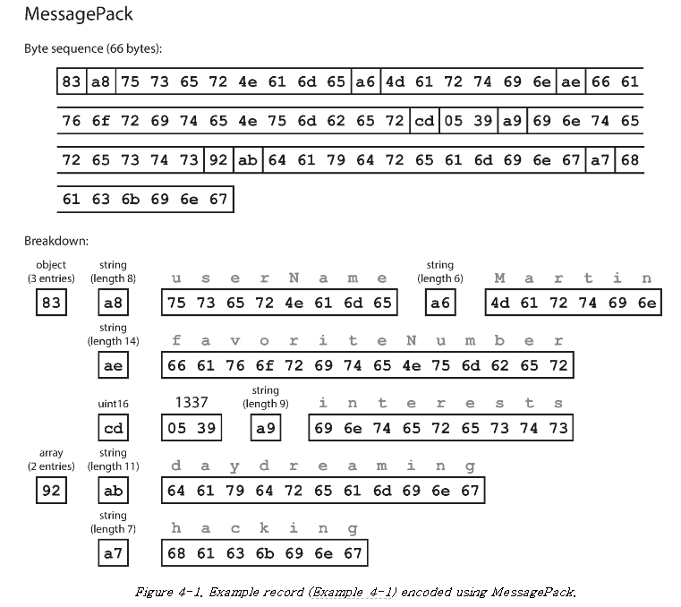
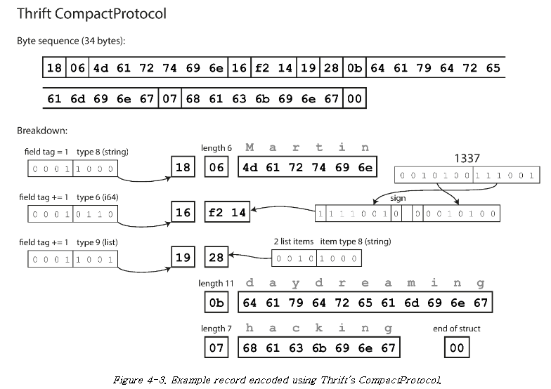
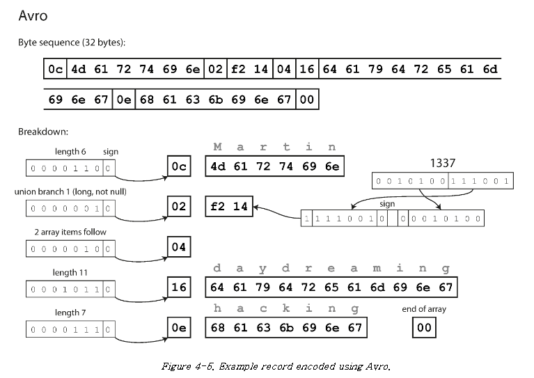
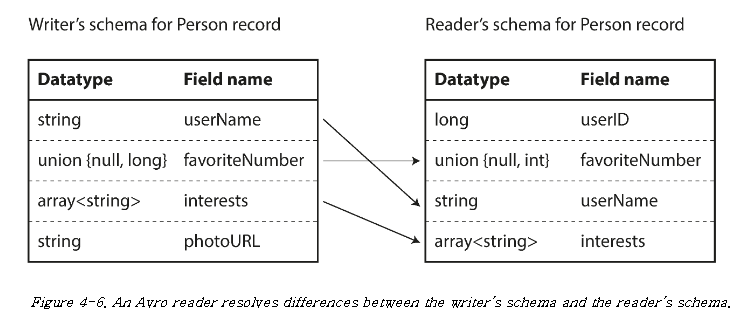
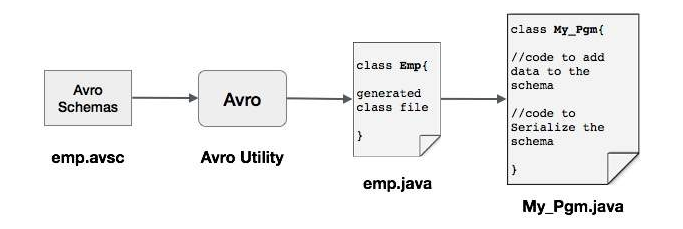
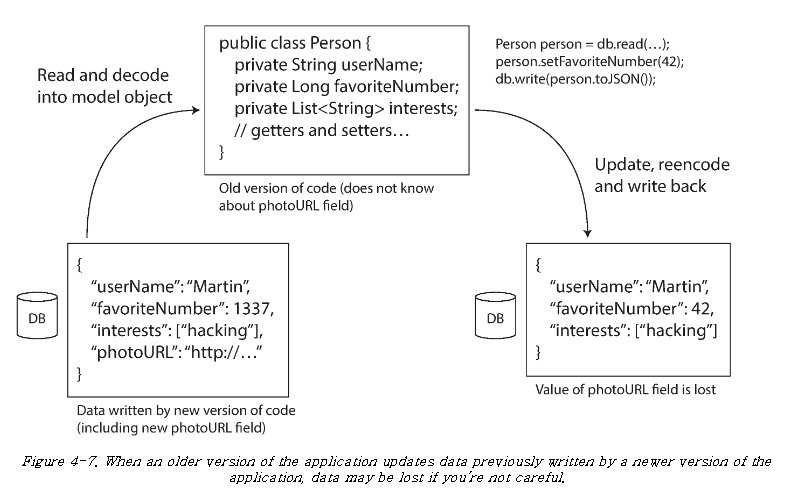
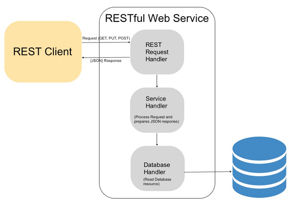
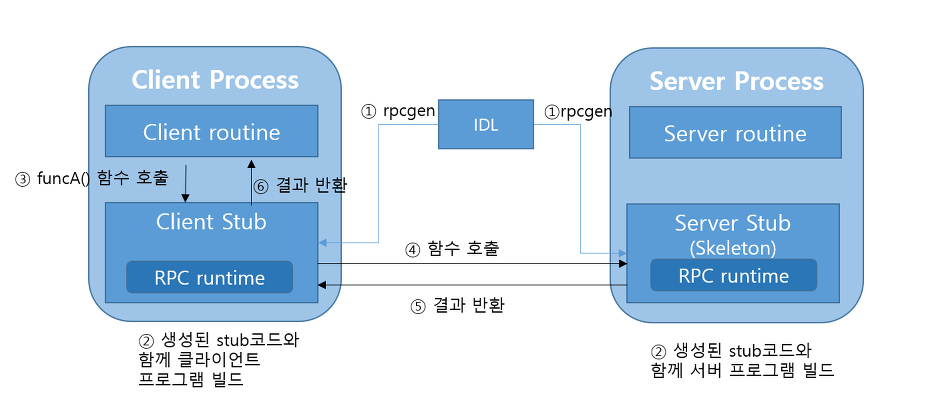
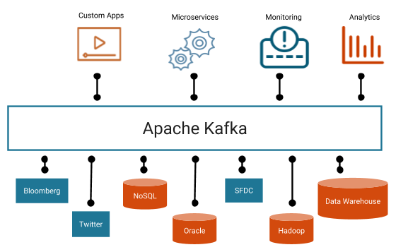

# 4장. 부호화와 발전(Encoding and Evolution)

프로그램은 보통 두 가지 이상의 형태로 표현된 데이터를 사용해 동작한다.  
객체, 배열, 해시테이블 등의 구조는 CPU에서 효율적으로 접근하고 조작할 수 있지만, 네트워크를 통해 전송하기에는 적합하지 않다.  
따라서 이를 바이트로 전환하는 부호화(**=직렬화**)를 하게되는데, 이 때 다양한 이진 부호화 기술들이 활용된다.

이번 장에서는 서비스 간 데이터를 교환하는 여러가지 방식과 그 세부 구현들(특히 이진 부호화)에 대해 알아보자.


위 그림에서 서비스 측면에서는 크게 **데이터베이스, 웹서비스/RPC, 메시징서비스** 정도로 나눌 수 있고  
부호화 방식은 크게 **텍스트, 이진부호화**로 나뉘며, 각 방식에 따른 기술들을 소개하고 있다.

<br/>

## 1. 전달방식 - 텍스트

가장 익숙한 텍스트 전달방식으로 대표적으로 JSON, XML, CSV가 있으며, 웹서비스(REST, SOAP)에서 사용된다.  
텍스트 형식은 사용이 쉽고 사람이 읽을 수 있는 형태이며 특히 JSON의 경우 웹 브라우저 자체에서 지원하는 형식이기 때문에 가장 널리 사용된다.

하지만 이러한 편리함에도 불구하고 몇 가지 단점이 존재한다.

- 수(number)의 표현이 애매하다.
- 큰 수를 다룰 때 문제가 발생할 수 있다.
- 이진문자열을 지원하지 않는다(ex. 매핑되는 문자가 없는 바이트열).
- XML, JSON은 스키마를 지원하지만 적용하기가 현실적으로 어렵다.
- CSV의 경우 스키마가 따로 없어서 컬럼 추가 시 잘못 해석될 가능성이 있다.

이러한 단점에도 불구하고 다양한 용도와 편의성때문에 지금까지 많이 사용됐고, 앞으로도 많이 사용될것이다.

<br/>

## 2. 전달방식 - 이진 부호화

많은 프로그래밍 언어는 인메모리 객체를 부호화하는 라이브러리를 갖고있다.  
내장 라이브러리는 간편하지만 많은 문제점을 야기하기 때문에 일시적인 목적 외에는 사용이 지양된다.

- 부호화가 특정 언어에 종속되면 다른 시스템이 데이터를 읽거나 쓰기 어렵다.
- 복호화 시 클래스를 인스턴스화 하기 때문에 원격 코드 실행(RCE) 취약점에 노출될 수 있다.
- 상위/하위호환성 문제가 발생할 수 있다.
- 성능 문제가 발생할 수 있다.

이진 부호화는 데이터베이스, RPC, 메시징서비스에서 사용되는 방식으로, 작은 데이터셋의 경우 부호화 형식 선택으로 얻는 이득이 적지만, 테라바이트 정도가 되면 데이터 타입의 선택이 큰 영향을 미친다. XML, JSON을 이진 부호화 하는 방식(MessagePack, WBXML 등)도 생겨났지만 장점이 크지 않아 널리 채택되진 않았다.

이번 장에서는 아래 레코드를 각 부호화 기술에 따라 변형해가며 설명을 돕는다. 눈에 잘 익혀두자.

**[예제 레코드]**

```json
{
    "userName": "Martin",
    "favoriteNumber": 1337,
    "interests": ["daydreaming", "hacking"]
}
```

<br/>

### a) MessagePack

MessagePack은 JSON을 이진부호로 바꾸는 라이브러리다.

#### MessagePack의 바이트 시퀀스

> Spec: https://github.com/msgpack/msgpack/blob/master/spec.md#formats

아래 이미지는 Formats 표에 따라 각 바이트를 해석할 수 있다.  
기존의 JSON 문자열(81바이트)을 바이트 시퀀스로 변환했음에도 길이는 **크게 줄어들지 않았다**.  
이처럼 가독성을 해치는데 반해 크게 이득이 크지 않다는 점 때문에 인기를 끌지 못했다.



<br/>

### b) 스리프트와 프로토콜 버퍼

스리프트(페이스북 개발), 프로토콜 버퍼(구글 개발)는 모두 데이터를 이진부호로 바꾸는 라이브러리다.

두 라이브러리 모두 부호화할 데이터를 위한 스키마가 필요하며, 이러한 스키마를 기술하는 언어를 IDL(Interface Definition Language)이라고 한다. 예제 레코드를 스리프트, 프로토콜 버퍼의 IDL로 각각 기술하면 아래와 같다.

**[스리프트 IDL]**

```idl
struct Person {
  1: required string       userName,
  2: optional i64          favoriteNumber,
  3: optional list<string> interests
}
```

**[프로토콜 버퍼 IDL]**

```idl
message Person {
    required string user_name       = 1;
    optional int64  favorite_number = 2;
    repeated string interests       = 3;
}
```

두 라이브러리는 이러한 IDL로부터 다양한 언어로 코드를 생성하는 도구를 제공하며, 프로그램은 이렇게 생성된 코드를 통해 레코드를 부호화(encoding), 복호화(decoding) 할 수 있다. 또한 required, optional 등의 표기를 통해 런타임 오류를 잡아낼 수 있다는 장점도 있다.

<br/>

#### 스리프트의 바이트 시퀀스(컴팩트 프로토콜)

> Spec: https://github.com/apache/thrift/blob/master/doc/specs/thrift-compact-protocol.md#struct-encoding

스리프트에는 크게 바이너리프로토콜, 컴팩트프로토콜이 있는데 컴팩트 프로토콜에 대해 알아보자.

스리프트와 프로토콜 버퍼에서는 필드이름 대신 **필드태그(1, 2, 3, ...)**를 활용하기 때문에 필드이름이 없이도 어떤 필드를 다루는지 알수 있다.  
이 방식을 사용함과 동시에, 수 타입 부호화 시 [가변 길이 정수](https://lucene.apache.org/core/3_5_0/fileformats.html#VInt)를 사용함으로써 바이트 시퀀스의 길이를 줄였다.  
그 결과 아래 예제에서 34바이트로 줄었음을 확인할 수 있다. 프로토콜 버퍼의 부호화 방식도 이와 유사하다.



#### 스키마 발전

여기서의 "스키마 발전"이란 시간이 지남에 따라 스키마가 변화하는것을 말한다.  
흔히 컬럼이 추가되는 등의 일이 있다. 이런 상황에서 중요시 되는것이 바로 **상위/하위호환성**이다.

- 상위호환성: 예전 코드는 새로운 코드가 기록한 데이터를 읽을 수 있어야 한다.
- 하위호환성: 새로운 코드는 예전 코드가 기록한 데이터를 읽을 수 있어야 한다.

이러한 스키마 발전은 긴 시간동안도 일어나고 짧은 시간동안에도 일어날 수 있다.  
예를 들어 애플리케이션을 롤링 업데이트 할 경우 실제로 구버전/신버전이 공존하게 되며, 호환성이 지켜지지 않았을 때 문제가 발생한다.

<br/>

```idl
struct Person {
  1: required string       userName,
  2: optional i64          favoriteNumber,
  3: optional list<string> interests
}
```

**필드 태그와 스키마 발전**

필드 태그는 변경할 수 없다(필드 이름은 변경 가능). 만약 새로운 필드를 추가한다면 해당 필드에는 새로운 태그 번호를 부여한다.  
새로운 태그번호에 대해 예전 코드는 해당 번호를 무시하고, 기존 태그번호는 항상 같은 의미를 가지기 때문에 상위/하위 호환성이 유지된다.  
`required`, `optional` 역시 신경써야 하는데, 스키마 초기 배포 이후에 추가되는 필드는 `optional`이거나 기본값을 가져야 상위 호환성이 유지된다.  
반대로 필드를 삭제할 경우 `required` 필드는 삭제할 수 없다.

**데이터타입과 스키마 발전**

데이터타입의 경우에도 변경할 수 없다. 예를 들어 32비트 정수를 64비트의 정수로 바꾼다면 새로운 코드가 기록한 데이터를 예전 코드가 읽을 때 데이터가 잘리므로 상위호환성이 지켜지지 않는다.

<br/>

### c) 아브로

아브로는 앞선 사례들과 다르지만 대적할만한 이진부호화 형식이다.  
아브로는 스리프트가 하둡의 사용 사례에 적합하지 않아 하둡의 하위 프로젝트로 시작되었다.

아브로에는 두 개의 스키마 언어가 있다. 하나는 사람이 읽을 수 있는 IDL, 하나는 기계가 이해할 수 있는 JSON 언어다.

**[IDL 표현]**

```idl
record Person {
    string               userName;
    union { null, long } favoriteNumber = null;
    array<string>        interests;
}
```

**[JSON 표현]**

```json
{
    "type": "record",
    "name": "Person",
    "fields": [
        {"name": "userName",       "type": "string"},
        {"name": "favoriteNumber", "type": ["null", "long"], "default": null},
        {"name": "interests",      "type": {"type": "array", "items": "string"}}
    ]
}
```

앞선 방식과 달리 아브로 스키마에는 태그번호가 없다. 이 스키마를 활용한 결과값은 지금까지 중 가장 짧은 32바이트다.

<br/>

#### 아브로의 바이트 시퀀스

> Spec: https://avro.apache.org/docs/1.11.1/specification/#data-serialization-and-deserialization

아브로에서 바이트열에는 앞선 방식과 다르게 필드, 데이터타입 식별정보가 없다. 부호화는 단순히 연결된 값으로 구성되기 때문에 스키마에 나타난 순서대로 필드를 살펴보고, 각 필드의 데이터타입을 파악해야 한다. 이것은 데이터를 쓰고 읽는 **스키마가 정확하게 같아야** 올바르게 복호화 된다는 것을 의미하지만 실제는 그렇지 않아도 된다. 이 내용은 아래 쓰기/읽기 스키마 설명을 통해 이해할 수 있다.



<br/>

#### 아브로의 스키마 발전

그렇다면 아브로는 스키마가 변경될경우 호환성이 망가지는것일까? 아브로의 스키마 발전 규칙에 대해 알아보자.  
아브로는 쓰기/읽기 스키마는 동일하지 않아도 되며, 호환 가능하면 된다는 생각을 기반으로 이를 해결했다.

> 쓰기/읽기 스키마는 따로 관리되는것은 아니고, 단순히 부호화/복호화에 직접 사용될 스키마를 말한다.

<br/>

데이터를 복호화 할 때 아브로 라이브러리는 쓰기/읽기 스키마를 살펴보고 그 차이를 해소한다.  
예를 들어 아래와 같이 읽기/쓰기 스키마가 다를 때 아브로는 다음 절차에 따라 **쓰기 스키마에서 읽기 스키마로 데이터를 변환**한다.

- 쓰기 스키마와 읽기 스키마 간 필드 순서 차이는 스키마 해석 시 이름으로 필드를 일치시켜 해소한다.
- 읽기 스키마에는 없고, 쓰기 스키마에만 존재하는 필드는 무시한다.
- 읽기 스키마에만 있고, 쓰기 스키마에는 없는 필드는 읽기 스키마에 선언된 기본값으로 채운다.



**스키마 발전 규칙**

따라서 아브로에서의 상위/하위 호환성은 쓰기/읽기 스키마가 아래 조합인 경우라고 이해하면 된다.

- 상위 호환성: 새로운 쓰기 스키마 + 예전 읽기 스키마
- 하위 호환성: 예전 쓰기 스키마 + 새로운 읽기 스키마

호환성을 유지하기 위해서는 기본값이 있는 필드만 추가/삭제할 수 있다. 그렇지 않을 경우 읽기/쓰기 스키마 차이를 해소하는 세번째 절차가 문제가 된다.

<br/>

> *읽기 스키마에만 있고, 쓰기 스키마에는 없는 필드는 읽기 스키마에 선언된 기본값으로 채운다.*

만약 위 이미지의 Reader 스키마에 기본값이 없는 userID를 추가했다고 하면, 예전에 쓰여진 레코드를 읽을 수 없어서 하위 호환성이 깨진다.  
만약 위 이미지의 Writer 스키마에서 기본값이 없는 userName 필드를 삭제했다고 하면, 예전 읽기 스키마로 읽을 수 없어서 상위 호환성이 깨진다.

아브로는 타입을 변환할 수 있으므로 필드의 데이터타입 변경이 가능하다. 또한 필드 이름도 변경 가능한데, 읽기 스키마는 필드 이름에 별칭을 포함할 수 있어 예전 쓰기 스키마와 필드 이름을 매치할 수 있다. 즉 필드 이름 변경은 하위 호환성이 있지만 상위 호환성은 없다.

<br/>

#### 쓰기 스키마는 어떻게 아는걸까?

특정 레코드가 어떤 스키마로 부호화 되었는지 어떻게 확인할지에 대한 의문도 있을것이다.  
당연하지만 레코드에 스키마 전체를 담아보내는것은 아니다. 몇 가지 예를 소개하면 아래와 같다.

- **많은 레코드가 있는 대용량 파일**: 모두 동일한 스키마로 부호화 된 파일을 만들고 시작부분에 한번만 쓰기 스키마를 포함시키는 방법.
- **개별적으로 기록된 레코드를 가진 데이터베이스**: 레코드 시작부분에 버전 번호를 포함하고 별도의 데이터베이스에서 가져오는방법.
- **네트워크 연결을 통해 레코드 보내기**: 사용할 스키마 버전을 합의해서 해당 버전으로만 레코드 전달하는 방법.

<br/>

#### 동적 생성 스키마

아브로는 태그 번호가 없고, JSON 형태의 스키마표현이 존재하기 때문에 동적 생성 스키마에 더 친숙하다.  
테이블의 컬럼명은 필드명에 매핑되며, 테이블을 보고 스키마를 생성할 수 있다.

#### 코드 생성

아브로는 정적 타입 프로그래밍 언어를 위한 코드 생성을 선택적으로 제공한다.  
선택적이라는 말은 코드생성 없이 동적 프로그래밍 언어에서도 사용 가능하다는 말이다.  
사용자는 아래와 같이 스키마로부터 자바 파일을 생성할 수 있다.




## 3. 데이터플로 모드

하나의 프로세스에서 다른 프로세스로 데이터를 전달하는 방법들에 대해 알아보자.

<br/>

### a) 데이터베이스를 통한 데이터플로

데이터베이스에는 여러 프로세스가 접근한다. 위에서 스키마 발전을 소개할 때 예시를 들었던 롤링 업데이트에 대해 생각해보자.  
동시에 신버전, 구버전의 인스턴스가 공존하므로 상위호환성, 하위호환성이 모두 필요하다.

아래는 구버전의 프로그램이 신버전의 코드를 덮어쓰면서 데이터가 유실되는 사례이다.



파싱 과정에서 photoURL이 필드값으로 들어가지 못하고 동일 레코드에 덮어씌워진 상황이다. 앞에서 설명한 부호화 형식은 이런 필드의 보존을 지원하지만 애플리케이션에서 주의하지 않으면 위와 같은 문제가 발생할 수 있으니 주의하도록 하자.

<br/>

### b) 서비스를 통한 데이터플로

네트워크를 통해 통신해야 하는 프로세스가 있을 때 가장 일반적인 방법으로 클라이언트-서버 모델을 사용한다.  
서버는 네트워크를 통해 API를 공개하고 클라이언트는 이 API로 요청을 만들어 서버에 연결할 수 있다.

#### 웹 서비스(REST/SOAP)

서비스와 통신하기 위한 기본 프로토콜로 HTTP를 사용할 때 이를 웹 서비스라고 한다.  
웹 서비스는 대표적으로 REST와 SOAP 방식이 있으며, 부호화는 텍스트(JSON, XML 등) 부호화를 사용하여 전달한다.

**[REST]**

REST는 간단한 데이터 타입을 강조하며 URL을 사용해 리소스를 식별하고 캐시제어, 인증, 콘텐츠유형협상에 HTTP 기능을 사용한다.  
간단한 접근방식을 선호하기 때문에 코드생성, 자동화된 도구와 거리가 멀며, 스웨거 같은 정의 형식을 통해 API와 제품 문서를 기술한다.



**[SOAP]**

SOAP은 웹 서비스 기술 언어(WSDL)를 통해 API를 기술한다. HTTP상에서 사용되지만 대부분의 HTTP의 기능을 사용하지 않는다.  
일반적으로 UDDI(Universal Description, Discovery, and Integration / 웹 서비스 관리 저장소)로부터 WSDL파일을 받아 API 스펙을 확인 후 서버-클라이언트 통신을 한다. WSDL을 보고 클라이언트와 메세지를 직접 구성하는건 어렵기 때문에 대부분 도구와 IDE에 크게 의존한다.


<br/>

#### 원격 프로시저 호출(RPC)

원격 프로시저 호출은 같은 프로세스 안에서 메서드를 호출하는것과 동일하게 네트워크 서비스 요청을 사용 가능하게 해주는 기술이다.  
이러한 추상화를 위치 투명성(location transparency)이라 한다.

**[RPC]**

RPC가 편리한것 같지만 네트워크 요청과 로컬 함수 호출은 매우 다르다. 네트워크 문제는 예측이 어려우며 제어하기도 어렵다.  
다음은 RPC가 로컬 함수와 다름에도 로컬 함수처럼 보이기 때문에 간과될 수 있는 문제들이다.

- 타임아웃으로 결과 없이 반환될 수 있다. 응답을 받지 못했다면 요청이 제대로 갔는지 확인할 방법이 없다.
- 요청이 처리가 됐는데 응답만 유실될수도 있다. 이럴 경우 프로토콜에 중복제거 멱등성이 보장되지 않으면, 같은 작업이 반복되는 결과를 초래할 수 있다.
- 네트워크 요청은 서버 상황에 따라 처리시간이 다르므로 소요시간을 정확히 예측하기 어렵다.
- 네트워크를 통해 전송하기 때문에 항상 바이트열로 부호화해야하며, 큰 객체라면 문제가 될 수 있다.
- 다른 언어로 작성된 프로그램과 통신할 때 자료형 불일치로 데이터가 잘릴 수 있다.



<br/>

### c) 메시지 전달 데이터플로

RPC와 데이터베이스 간 비동기 메시지 전달 시스템을 간단히 살펴보자.  
이 시스템은 메시지 브로커(또는 메시지 큐)라는 중간단계를 거쳐 전송한다. 이를 사용하면 다음과 같은 장점이 있다.

- 수신자가 사용불가/과부하 상태라면 메시지 브로커가 버퍼 역할이 되기 때문에 시스템 안정성이 향상됨.
- 위 항목으로 인해 메시지 유실을 방지할 수 있음.
- 송신자가 수신자의 IP/포트를 알 필요가 없음.
- 하나의 메시지를 여러 수신자에게 전송 가능.
- 논리적으로 송신자와 수신자가 분리됨.

**[메시지브로커]**

메시지 브로커의 세부적인 전달 방식은 구현/설정에 따라 다양하지만 일반적으로 다음과 같이 사용한다.

- 프로세스 하나가 메시지를 큐(queue)로 전송한다.
- 브로커는 해당 메시지를 해당 큐(queue)의 소비자(consumer)에게 전달한다.
- 동일한 토픽에 여러 생산자(producer)와 소비자가 있을 수 있다.

메시지 전달 통신은 **단방향**이며, **비동기**라는 점이 RPC와 다르다.  
메시지는 일부 메타데이터를 가진 바이트열이므로, **모든 부호화 형식을 사용할 수 있다**.



**[분산 액터 프레임워크]**

> 상세설명: https://medium.com/spoontech/akka-framework-%EC%9E%85%EB%AC%B8%EA%B8%B0-8fdc3d7c878d

액터 모델은 단일 프로세스 안에서 동시성을 위한 프로그래밍 모델이다. 다음은 액터모델에 관한 설명이다.

- 스레드관리를 직접 처리하는 대신 로직이 액터에 캡슐화된다.
- 각 액터는 하나의 클라이언트나 엔티티를 나타낸다.
- 액터는 로컬 상태를 가질 수 있고 비동기 메시지의 송/수신으로 다른 액터와 통신한다.
- 액터는 메시지 전달을 보장하지 않으며 에러 상황에서 메시지는 유실될 수 있다.
- 각 액터 프로세스는 한번에 하나의 메시지만 처리하기 때문에 스레드세이프하다.

분산 액터 프레임워크에서 이 모델은 여러 노드간의 애플리케이션 확장에 사용된다.  
액터 기반 애플리케이션 역시 순회식으로 업그레이드 될 수 있으며, 이 경우 버전이 다른 노드끼리 메시지를 주고 받을 수 있다.  
따라서 이 역시 상위/하위호환성에 주의해야 한다.

인기 있는 분산 프레임워크 세 가지는 다음과 같이 메시지 부호화를 처리한다.

- 아카(Akka)는 자바의 내장직렬화를 사용하기 때문에 상위/하위호환성을 제공하지 않는다.
  하지만 프로토콜 버퍼와 같은 부호화 형식으로 대체할 수 있으며, 이 경우 순회식 업그레이드를 수행할 수 있다.
- 올리언스(Orleans)는 사용자 정의 부호화 형식을 사용하며, 이 방식은 순회식 업그레이드를 제공하지 않는다.
  아카와 마찬가지로 사용자 정의 직렬화 플러그인을 사용할 수 있다.
- 얼랭(erlang) OTP에서는 레코드 스키마를 변경하는일이 의외로 어렵다. 순회식 업그레이드는 가능하지만 신중하게 해야한다.

<br/>

## 4. 정리

부호화는 효율성 뿐만 아니라 애플리케이션의 아키텍쳐와 배포의 선택사항에도 영향을 미친다.  
다양한 데이터 부호화 형식과 호환성 속성을 복습하면 다음과 같다.

- 프로그래밍 언어에 종속된 부호화는 타 언어와의 통합을 제한하며 상위/하위호환성도 제공하지 않을 수 있다.
- JSON, XML과 같은 텍스트 형식은 널리 사용된다. 이진문자열 사용에는 제약이 있을 수 있다.
- 스리프트, 프로토콜 버퍼, 아브로 같은 스키마 기반 형식은 짧은 길이로 부호화되며, 호환성 측면에서도 효율적인 부호화를 지원한다.
- 데이터베이스, RPC, REST, 비동기메시징 등 다양한 데이터플로에서 상/하위 호환성을 고려하여 개발하자.
  애플리케이션의 발전은 더욱 빨라지고 배포 빈도도 높아지게 된다.