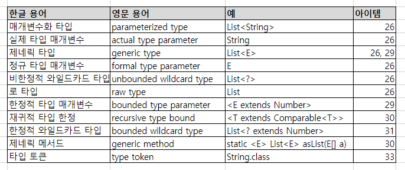

## [item 26] Raw 타입은 사용하지 말라

<br>

**제네릭 타입**  
List 인터페이스는 원소의 타입을 나타내는 타입 매개변수 E를 받는다.  
이렇게 타입매개변수를 받는 타입을 **제네릭 타입**이라고 한다.  
ex) List < E >

**Raw 타입**  
제네릭 타입에서 타입 매개변수를 받지 않을 때를 말한다.  
ex) List  


```java
// 26-1 로 타입 - 따라하지 말 것
private final Collection stamps = ...; // stamp 인스턴스만 취급
stamps.add(new Coin(...)); // "unchecked call" 경고를 내뱉는다

for (Iterator i = stamps.iterator(); i.hasNext(); ) {
    Stamp stamp = (Stamp) i.next(); // ClassCastException 발생
    Stamp.cancel();
}
```

위처럼 Raw 타입을 사용 할 경우 Stamp 대신 Coin을 add 해도 오류없이 컴파일 되고 실행된다.  
오류는 가능한 한 발생 즉시, 이상적으로는 컴파일할 때 발견하는 것이 좋다.


```java
// 26-3 매개변수화 된 컬렉션 타입 - 타입 안정성 확보 됨
private final Collection<Stamp> stamps = ...; // stamps 인스턴스만 취급 -> 이 주석도 필요가 x
```

이렇게 작성하면 정보가 주석이 아닌 타입 선언 자체에 녹아든다.  
컴파일러는 stamps에는 Stamp의 인스턴스만 넣어야 함을 컴파일러가 인지하게 된다.  
경고 없이 컴파일 된다면 의도대로 동작함을 보장한다. (컴파일러가 컬렉션에서 원소를 꺼내는 모든 곳에 보이지 않는 형변환을 추가)

Raw 타입은 호환성을 위해 남겨둔 것이고, 제네릭이 주는 안전성과 표현력을 잃게 되므로 절대로 써서는 안된다.

List는 안되나, List< Object > 타입은 괜찮다.
어떤 차이가 있을까?
- List< Object >는 모든 타입을 허용한다는 의미
- 매개변수로 List를 받는 메서드에 List< String > 을 넘길 수 있음
- 매개변수로 List< Object >를 받는 메서드에는 List< String >을 넘길 수 없음
- List< String >은 List< Object >의 하위타입이 아니기 때문 

```java
// 26-4 런타임 실패 - unsafeAdd 메서드가 Raw 타입 사용
public interface PhysicalConstants {
    public static void main(String[] args) {
        List<String> strings = new ArrayList<>();
        
        unsafeAdd(strings, Integer.valueOf(42));
        String s = strings.get(0); // 컴파일러가 자동으로 형변환 코드를 넣어줌
    }
    
    private static void unsafeAdd(List list, Object o) {
        list.add(o); // 로타입
    }
}
```

이 코드는 컴파일은 되지만 경고가 발생한다.  
unchecked call to add(E) as mem ber of the raw type List
      list.add(o);  

이 프로그램을 이대로 실행하면 strings.get(0) 의 결과를 형변환 할 때 ClassCastException을 던진다.

Raw 타입인 List를 List<Object> 으로 바꾼다음 다시 컴파일 해보면, 컴파일 조차 되지 않는다.
incompatible types: List<String> cannot be converted to List<Object>
    unsafeAdd(strings, Integer.valueOf(42));


잘못된 로타입의 사용  

```java
// 26-5 잘못된 예 - 모르는 타입의 원소도 받는 로 타입을 사용함
static int numElementsInCommon(Set s1, Set s2) {
    int result = 0;
    
    for (Object o1 : s1)
        if (s2.contains(o1))
            result++;
        
    return result;
}
```

이 메서드는 동작하지만 Raw 타입으로 안전하지 않다.  
제네릭 타입을 쓰고 싶지만 실제 타입 매개변수가 무엇인지 신경쓰고 싶지 않을 때는 물음표(?)를 사용하자
Set<E> : 제네릭 타입  
Set<?> : 비한정적 와일드카드 타입
?는 어떠한 타입이라도 담을 수 있는 가장 범용적인 매개변수화 타입이다.

```java
// 26-6 비한정적 와일드카드 타입 - 타입 안전하며 유연함
static int numElementsInCommon(Set<?> s1, Set<?> s2) {
    ...
}
```

Set<?>와 Raw 타입의 Set는 무슨차이일까?  
와일드카드 타입은 안전하고, 로 타입은 안전하지 않다.
Collection<?>에는 null을 제외한 어떠한 원소도 넣을 수 없다.
다른 원소를 넣으려 하면 컴파일 할때 다음 오류메시지를 확인할 수 있다.

incompatible types: String cannot be converted to CAP#1
    c.add("verbotren");
where CAP#1 is a fresh type-variable:
    CAP#1 extends Object from capture of ?

컬렉션의 타입 불변식을 훼손하지 못하게 막았다.  
구체적으로는, null 이외의 어떤 원소도 Collection<?>에 넣지 못하게 했으며  
컬렉션에서 꺼낼 수 있는 객체의 타입도 전혀 알 수 없게 했다.
(Collection<?>에 어떤 타입의 Collection이 올지 모르기 때문에 타입이 존재하는 값을 넣을수 없음 -> 31장 참고)

### raw 타입을 사용하는 예외

1. class 리터럴
- List.class
- List<String>.class

2. instanceof 연산자
- 런타임시 제네릭 정보가 지워져 instanceof 연산자는 비한정적 와일드카드 타입 이외 타입에 적용 불가
- 로타입, 비한정적 와일드카드 타입 모두 instanceof 동일하게 동작 
- 깔끔한 raw 타입을 쓰자


```java
// 26-7 raw 타입을 써도 좋은 예 - instanceof 연산자
if (o instanceof Set) { // 로타입
    Set<?> s = (Set<?>) o; // 와일드카드 타입
    ...
}
```


### 핵심정리
Raw 타입은  
- 런타임에 익셉션 발생
- 호환성을 위해 남아 있는것 뿐
- instanceof, class 리터럴을 제외하고 사용하지 말자

### 참고 - 용어 정리
