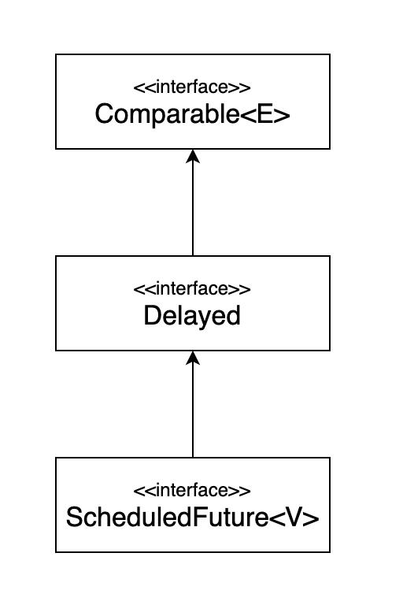

## [item 31] 한정적 와일드카드를 사용해 API 유연성을 높여라

<br>


매개변수화 타입은 불공변(invariant)  
ex) List< String >  
List< Type1 >은 List< Type2 >의 하위타입도 상위 타입도 아니다. (리스코프 치환원칙에 위배)  
List< String > 은 List < Object >가 하는 일을 제대로 수행하지 못하니 하위타입이 될 수 없음.

이럴때 필요한 유연한 것: 한정적 와일드카드

Stack API에 일련의 원소들을 넣는 메서드를 추가한다고 가정해보자

```java
public class Stack<E> {
    public Stack() {} 

    public void push(E e) {}

    public E pop() {}

    public boolean isEmpty() {}

    private void ensureCapacity() {}
    
    // public void pushAll(Iterable<E> src) { ... } 추가
}
```

아래와 같이 추가한다면?

```java
// 코드 31-1 와일드카드 타입을 사용하지 않은 pushAll 메서드 - 결함이 있다!
public void pushAll(Iterable<E> src) {
    for (E e : src)
    push(e);
}
```
컴파일은 되지만 완벽하지 않음.

Stack< Number >로 선언 후 pushAll(Integer타입) 을 하게 된다면?
Integer는 Number의 하위 타입이니 잘 동작할것 같지만 오류메시지가 출력 됨.

```java
StackTest.java:7: error: incompatible types: Iterable
        cannot be converted to Iterable
        numberStack.pushAll(integers);
        ⌃
```

제네릭의 매개변수화 타입은 불공변이라 상위-하위 자료형 관계가 없음.
자바는 이런 상황에 대처할 수 있는 한정적 와일드카드 타입이라는 특별한 매개변수화 타입을 지원한다.  
pushAll의 입력 매개변수 타입은 E의 Iterable이 아니라 E의 하위 타입의 Iterable이어야 하며,  
와일드 카드 타입 Iterable<? extends E> 가 정확히 이런 타입이다.   
와일드카드 타입을 사용하도록 pushAll 메서드를 수정해보자.


```java
 // 코드 31-2 E 생산자(producer) 매개변수에 와일드카드 타입 적용
public void pushAll(Iterable<? extends E> src) {
    for (E e : src)
    push(e);
}
```

Number-Integer 예시에서
Iterable< Number>가 아닌 Iterable<? extends Number> 가 되므로 Integer도 포함할 수 있게 됨


pushAll과 짝을 이루는 popAll 메서드를 다음과 같이 작성했다고 해보자.
popAll 메서드는 Stack안의 모든 원소를 주어진 컬렉션으로 옮기는 메서드이다.

```java
// 코드 31-3 와일드카드 타입을 사용하지 않은 popAll 메서드 - 결함이 있다!
public void popAll(Collection<E> dst) {
    while (!isEmpty())
        dst.add(pop());
}
```

이는 결국 앞의 pushAll을 사용했을 때와 비슷한 오류가 발생한다.   
이번에는 popAll의 입력 매개변수의 타입이 'E의 Collection'이 아니라 'E의 상위 타입의 Collection'이어야 한다.  
와일드카드 타입을 사용한 Collection<? super E>가 정확히 이런 의미이다.  


```java
// 코드 31-4 E 소비자(consumer) 매개변수에 와일드카드 타입 적용
// E의 컬렉션이 아닌 E의 상위 타입의 컬렉션으로 선언
public void popAll(Collection<? super E> dst) {
    while (!isEmpty())
        dst.add(pop());
}
```

메시지는 분명하다.  
유연성을 극대화하려면 원소의 생성자나 입력 매개변수에 와일드카드 타입을 사용하라.  
한편, 입력 매개변수가 생산자와 소비자 역할을 동시에 한다면 와일드카드 타입을 써도 좋을 게 없다.   
타입을 정확히 지정해야 하는 상황으로, 이때는 와일드카드 타입을 쓰지 말아야 한다.   
다음 공식을 외워두면 어떤 와일드카드 타입을 써야 하는지 기억하는데 도움이 될 것이다. 


팩스(PECS) : producer-extends, consumer-super

- 매개변수화 타입 T가 생산자라면 <? extends T>를 사용하고
- 소비자라면 <? super T>를 사용하라. 


```java
// src는 stack이 사용할 인스턴스 e를 생산하므로 Producer -> extends 사용
public void pushAll(Iterable<? extends E> src) {
    for (E e : src)
        push(e);
}

// dst는 stack의 원소들을 소비하므로 counsumer -> super 사용
public void popAll(Collection<? super E> dst) {
    while (!isEmpty())
        dst.add(pop());
}
```

----------------------

메서드 정의시 타입 매개변수 VS 와일드카드

```java
public static <E> void swap(List<E> list, int i, int j); // 타입 매개변수 스왑
public static void swap(List<?> list, int i, int j); // 와일드카드 스왑
```

어떤 선언이 나을까? 더 나은 이유는 무엇일까?  
public API라면 간단한 두 번째 원소가 낫다. (타입 매개변수를 신경 쓸 필요가 없으므로)
하지만 두 번째 swap 선언에는 문제가 하나 있는데, 다음과 같이 아주 직관적으로 구현한 코드가 컴파일되지 않는다는 것이다.

```java
public static void swap(List<?> list, int i, int j) {
    list.set(i, list.set(j, list.get(i)));
}
```

```java
Swap.java:5: error: incompatible types: Object cannot be
converted to CAP#1
        list.set(1, list.set(i, list.get(j)));

where CAP#1 is a fresh type-variable:
CAP#1 extends Object from capture of ?
```

방금 꺼낸 원소를 리스트에 다시 넣는 코드에서 컴파일 오류가 발생한다.
원인은 리스트의 타입이 List<?>인데, List<?>에는 null 외에는 어떤 값도 넣을 수 없다는 데 있다.
(List<?>에 어떤 타입의 List가 올지 모르기 때문에 타입이 존재하는 값을 넣을수 없음)
이 경우 와일드카드 타입의 실제 타입을 알려주는 메서드를 private 도우미 메서드로 따로 작성하여 활용하는 방법이다.  
실제 타입을 알아내려면 이 도우미 메서드는 제네릭 메서드여야 한다. 

```java
public static void swap(List<?> list, int i, int j) {
    swapHelper(list, i, j);
}
```

```java
// 와일드카드 타입을 실제 타입으로 바꿔주는 private 도우미 메서드
private static <E> void swapHelper(List<E> list, int i, int j) {
    list.set(i, list.set(j, list.get(i)));
}
```

swapHelper 메서드는 리스트가 List<E>임을 알고 있음.  
즉, 이 리스트에서 꺼낸 값의 타입은 항상 E이고, E 타입의 값이라면 이 리스트에 넣어도 안정함을 알고 있다.  
결국 이렇게 헬퍼를 사용하는 이유는 public API를 와일드카드 타입으로 유연성 있게 제공하는것이 목적.  

### 핵심정리
- 와일드카드 타입을 적용하면 API가 유연해진다
- PECS 공식을 기억하자
- producer는 extends를 consumer는 super를 사용한다
- Comparable과 Comparator 모두 소비자라는 사실을 잊지 말자


-------------------------

참고:

PECS 공식으로 앞 아이템들에서 소개한 메서드와 생성자 선언을 다시 살펴보자.  
아이템 28의 Chooser 생성자는 다음과 같이 선언했다.

```java
public Chooser(Collections<T> choices)
```

이 생성자로 넘겨지는 choices 컬렉션은 T 타입의 값을 생산하기만 하니,  
T를 확장하는 와일드카드 타입을 사용해 선언해야 한다.

```java
public Chooser(Collection<? extends T> choices)
```

이렇게 수정하면 실질적인 차이가 생길까? 그렇다.   
Chooser의 생성자에 List를 넘기고 싶다고 해보자.  
수정 전 생성자로는 컴파일조차 되지 않겠지만,  
한정적 와일드카드 타입으로 선언한 수정 후 생성자에서는 문제가 사라진다.

이번엔 아이템 30에서 언급됐던 union 메서드 차례다.

```java
public static <E> Set<E> union(Set<E> s1, Set<E> s2)
```

s1과 s2 모두 E의 생산자이니 PECS 공식에 따라 다음처럼 선언해야 한다.

```java
public static <E> Set<E> union(Set<? extends E> s1, Set<? extends E> s2)
```

> 반환 타입은 여전히 Set< E >임에 주목하자.  
> 반환 타입에는 한정적 와일드카드 타입을 사용하면 안된다.  
> 유연성을 높여주기는 커녕 클라이언트 코드에서도 와일드카드 타입을 써야하기 때문이다.

수정한 선언을 사용하면 다음 코드도 말끔히 컴파일된다.

```java
Set<Integer> integers = Set.of(1, 3, 5);
Set<Double> doubles = Set.of(2.0, 4.0, 6.0);
Set<Number> numbers = union(integers, doubles);
```

제대로만 사용한다면 클래스 사용자는 와일드카드 타입이 쓰였다는 사실조차 의식하지 못할 것이다.  
받아들여야 할 매개변수를 받고 거절해야 할 매개변수는 거절하는 작업이 알아서 이뤄진다.  
클래스 사용자가 와일드카드 타입을 신경 써야 한다면 그 API에 무슨 문제가 있을 가능성이 크다.

앞의 코드는 자바 8부터 제대로 컴파일된다.  
자바 7까지는 타입 추론 능력이 충분히 강력하지 못해서 문맥에 맞는 반환 타입(혹은 목표 타입)을 명시해야했다.  
예컨대 앞 코드에서 union 호출의 목표 타입은 Set 다.  
자바 7까지는 (Set.of 팩터리를 다른 것으로 적절히 변경한 후) 이 코드를 컴파일하면 다음처럼 아주 길고 난해한 오류 메시지를 보게 된다.

```java
Union.java:14: error: incompatible types
Set numbers = union(integers, doubles);
⌃
required: Set
found: Set<INT#1>
where INT#1,INT#2 are intersection types:
INT#1 extends Number, Comparable<? extends INT#2> INT#2 extends Number, Comparable<?>
```

다행히 해결할 수 있는 오류다.   
컴파일러가 올바른 타입을 추론하지 못할 때면 언제든 명시적 타입 인수(explict type arguments)를 사용해서 타입을 알려주면 된다.  
목표 타이핑은 자바 8부터 지원하기 시작했는데, 그 전 버전에서도 이 문제는 흔치 않았다.  
어찌됐건, 다음처럼 명시적 타입 인수를 추가하면 자바 7 이하에서도 깨끗이 컴파일 된다.

```java
Set<Number> numbers = Union.<Number>union(integers, doubles);
```

> 매개변수(=parameter)와 인수(=argument)의 차이를 알아보자.  
> 매개변수는 메서드 선언에 정의한 변수이고, 인수는 메서드 호출 시 넘기는 실제값이다.

```java
void add(int value) { ... }
add(10);
```

이 코드에서 value는 매개변수이고 10은 인수다. 이 정의를 제네릭까지 확장하면 다음과 같다.

```java
class Set<T> { ... }
Set<Integer> = ...;
```

여기서 T는 타입 매개변수가 되고, Integer는 타입 인수가 된다.  
보통은 이 둘을 명확히 구분하지 않으니 크게 신경 쓸 필요 없지만,  
자바 언어 명세에서는 구분하고 있어서 설명을 덧붙였다.

이전의 max 메서드를 와일카드 타입을 사용해 다듬은 모습은 다음과 같다.

```java
public static <E extends Comparable<? super E> E max(List<? extends E> list)
```

이번에는 PECS 공식을 두 번 적용했다.  
둘 중 더 쉬운 입력 매개변수 목록부터 살펴보자.  
입력 매개변수에서는 E 인스턴스를 생산하므로 원래의 List<E>를 List<? extends E>로 수정했다.

다음은 더 난해한 쪽인 타입 매개변수 E로, 이 책에서 타입 매개변수에 와일드카드를 적용한 첫 번째 예이기도 하다.
원래 선언에서는 E가 Comparable<E> 를 확장한다고 정의했는데, 이 때 Comparable<E>는 E 인스턴스를 소비한다.  
그래서 매개변수화 타입 Comparable<E>를 한정적 와일드카드 타입인 Comparable<? super E>로 대체했다.  
Comparable은 언제나 소비자이므로, 일반적으로 Comparable<E> 보다는 Comparable<? super E>를 사용하는 편이 낫다.  
Comparator도 마찬가지다. 일반적으로 Comparator<E> 보다는 Comparator<? super E>를 사용하는 편이 낫다.  
수정된 버전의 max는 이 책에서 가장 복잡한 메서드 선언일 것이다.  
이렇게까지 복잡하게 만들만한 가치가 있을까? 이번에도 답은 '그렇다'이다.  
그 근거로, 다음 리스트는 오직 수정된 max로만 처리할 수 있다.

```java
List<ScheduledFuture<?>> scheduledFutures = ...;
```

수정 전 max가 이 리스트를 처리할 수 없는 이유는 ScheduledFuture가 Comaparable<ScheduledFuture>를 구현하지 않았기 때문이다.  
ScheduledFuture는 Delayed의 하위 인터페이스이고, Delayed는 Comparable<Delayed>를 확장했다.   
다시 말해, ScheduledFuture의 인스턴스는 다른 ScheduledFuture 인스턴스뿐 아니라 Delayed 인스턴스와도 비교할 수 있어서 수정 전 max가 이 리스트를 거부하는 것이다.  
더 일반화해서 말하면, Comparable(혹은 Comparator)을 직접 구현하지 않고, 직접 구현한 다른 타입을 확장한 타입을 지원하기 위해 와일드카드가 필요하다.

Comparable<E>와 Delayed와 ScheduledFuture<V>의 관계는 다음 그림과 같다.




코드로는 다음처럼 선언되어 있다.

```java
public interface Comparable<E>
public interface Delayed extends Comparable<Delayed>
public interface ScheduledFuture<V> extends Delayed, Future<V>
```

타입 매개변수와 와일드카드에는 공통되는 부분이 있어서, 메서드를 정의할 때 둘 중 어느 것을 사용해도 괜찮을 때가 많다.  
예를 들어 주어진 리스트에서 명시한 두 인덱스의 아이템들을 교환(swap)하는 정적 메서드를 두 방식 모두로 정의해보자.  
다음 코드에서는 첫 번째는 비한정적 타입 매개변수를 사용했고 두 번째는 비한정적 와일드카드를 사용했다.
