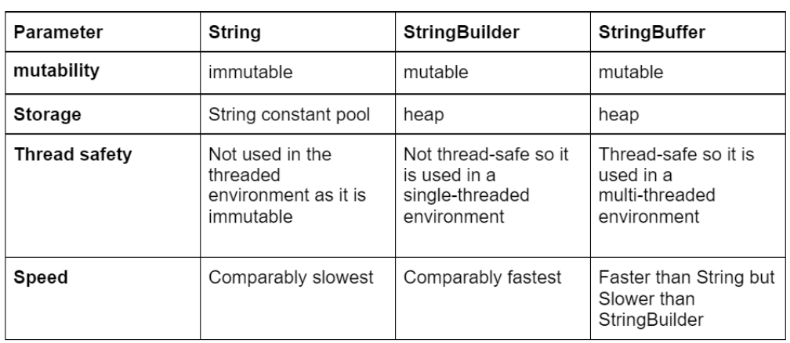

## [item 63] 문자열 연결은 느리니 주의하라

문자열 연결 연산자 (+)는 편리하지만 성능 저하를 감내하기 어렵다.  
(문자열 n개를 잇는 시간은 n^2의 비례)

```java
// 63-1 문자열 연결을 잘못 사용한 예 - 느리다!
public String statement() {
    String result = "";
    for (int i = 0; i < numItems(); i++) {
        result = += lineForItem(i);
    }
}
```

품목이 많을 경우 이 메서드는 심각하게 느려질 수 있음

```java
// 63-2 StringBuilder를 사용하면 문자열 연결 성능이 크게 개선됨
public String statement2() {
    StringBuilder b = new StringBuilder(numItems() * LINE_WIDTH);
    for (int i = 0; i < numItems(); i++) 
        b.append(lineForItem(i));
    return b.toString();
}
```

100 품목 테스트 시 아래 코드가 6.5배가 빨랐음 (StringBuilder 사용시 결과를 담기에 충분한 크기로 초기화를 시켰음)  
품목수가 늘어날수록 성능 격차도 점점 벌어 질 것

### 핵심 정리
- 성능에 신경써야 한다면 문자열 연결시 (+)는 피하자
- StringBuilder의 append 메서드를 사용하자


### 번외
String vs StringBuffer vs StringBuilder



참고
https://medium.com/quick-code/what-is-the-difference-between-string-stringbuilder-and-stringbuffer-6b8a998f6eae   
http://egloos.zum.com/deblan2/v/419830 - String, StringBuffer, StringBuilder 속도 실험 (시간 측정) - deblan2  